# Проект: "Защита OTP-кодом от Promo IT"

Этот сервис предоставляет API для генерации, валидации и управления одноразовыми кодами подтверждения (OTP) с
возможностью отправки по SMS, Email, Telegram и сохранением в файл.

## Стек технологий

- Java
- Maven
- PostgreSQL
- JavaMail API
- SMPP (SMPPsim)
- Telegram Bot API
- SLF4J + Logback
- Gson
- JWT (JJWT)

---

## Как запустить

1. Установите:
    - Java 17+
    - Maven
    - PostgreSQL (и создайте схему `service`)

2. Склонируйте проект:
   ```bash
   git clone https://github.com/OgBludo/otp-service.git
   cd otp-service
    ```
3. Проведите настройку проекта:

   В папке `src/main/resources` отредактируйте файлы заменив их вашими значениями.

   Файл `email.properties`
    ```
   email.username=your_email@gmail.com
    email.password=your_app_password
    email.from=your_email@gmail.com
    mail.smtp.host=smtp.gmail.com
    mail.smtp.port=587
    mail.smtp.auth=true
    mail.smtp.starttls.enable=true
    ```
   Файл `sms.properties`
    ```
   smpp.host=localhost
    smpp.port=2775
    smpp.system_id=smppclient1
    smpp.password=password
    smpp.system_type=OTP
    smpp.source_addr=OTPService
    ```
   Файл `telegram.properties`
    ```
   stelegram.api.url=https://api.telegram.org/bot<your_bot_token>/sendMessage
    telegram.chat.id=<your_chat_id>

    ```
   Далее отредактируйте поля файла `src/main/java/com.otp.db/Database.java` вашими значениями (Важно чтобы у вас был
   установлен PostgreSQL и создана в нем схема service)

   Поля для редактирования:
    ```Java
    private static final String URL = "yourURL";
    private static final String USER = "youruser";
    private static final String PASSWORD = "youruserpassword";
    private static final String SCHEMA = "service";
    ```
   Далее необходимо создать таблицы в бд, ниже приведены примеры SQL запросов для их создания:

   Начальная настройка:
    ```SQL
   CREATE SCHEMA IF NOT EXISTS service;
    SET search_path TO service;
    CREATE TYPE otp_status AS ENUM ('ACTIVE', 'EXPIRED', 'USED');
   ```
   Таблица пользователей `users`
    ```SQL
   CREATE TABLE service.users (
    id SERIAL PRIMARY KEY,
    username VARCHAR(100) UNIQUE NOT NULL,
    password TEXT NOT NULL,
    role VARCHAR(20) NOT NULL CHECK (role IN ('user', 'admin'))
    );
   ```
   Таблица OTP-кодов `otp_codes`
    ```SQL
    CREATE TABLE service.otp_codes (
    id SERIAL PRIMARY KEY,
    user_id INTEGER NOT NULL REFERENCES service.users(id) ON DELETE CASCADE,
    code VARCHAR(20) NOT NULL,
    created_at TIMESTAMP NOT NULL,
    expires_at TIMESTAMP NOT NULL,
    status otp_status NOT NULL,
    operation TEXT
    );
   ```
   Таблица конфигурации `otp_config`
    ```SQL
   CREATE TABLE service.otp_config (
    id INTEGER PRIMARY KEY,
    code_length INTEGER NOT NULL DEFAULT 6,
    expiration_time INTEGER NOT NULL DEFAULT 180 -- в секундах
    );
   ```
   Начальная конфигурация
    ```SQL
   INSERT INTO service.otp_config (id, code_length, expiration_time)
    VALUES (1, 6, 180)
    ON CONFLICT (id) DO NOTHING;
   ```
4. Соберите проект выполнив в консоли `mvn clean package
`
5. Запустите проект выполнив в консоли `java -jar target/otp-1.0-SNAPSHOT.jar
`

## Какие команды поддерживаются

Так как данный проект представляет backend приложения, для его работы потребуется либо утилита `curl` либо
инструменты для тестирования API, к примеру Postman.

Поддерживаемые команды будут приведены в формате API запросов.

API запросы для данного сервиса:

- POST /register
  – Регистрация пользователя
  Описание: Регистрирует нового пользователя (user или admin).

  Тело запроса (JSON):
    ```JSON 
    {
       "username": "john_doe",
       "password": "secure_password",
       "role": "user"
    }
    ```
- POST /login
  – Авторизация пользователя
  Описание: Выполняет вход и возвращает JWT-токен.

  Тело запроса (JSON):
    ```JSON 
    {
      "username": "john_doe",
      "password": "secure_password"
    }
    ```
- POST /otp/generate
  – Генерация OTP-кода
  Требуется авторизация (JWT-токен в `Authorization: Bearer ...`)

  Описание: Генерирует OTP-код для пользователя и рассылает его через указанный канал.

  Тело запроса (JSON):
    ```JSON
    {
      "operation": "login",
      "channel": "email",     // email | telegram | sms | file
      "destination": "user@example.com"  // email или номер телефона (в случае с telegram, можно не указывать)
    }
  ```
- POST /otp/validate
  – Проверка OTP-кода
  Описание: Проверяет корректность OTP-кода.

  Тело запроса (JSON):
    ```JSON
    {
      "userId": 1,
      "code": "123456"
    }
  ```
- GET /admin/users
  – Получить список пользователей.
  Требуется авторизация администратора

  Описание: Возвращает всех пользователей (Требует авторизации через `Authorization: Bearer <admin_jwt_token>`).
- DELETE /admin/users/delete
  – Удаление пользователя
  Требуется авторизация администратора

  Тело запроса (JSON):
    ```JSON
    {
      "username": "john_doe"
    }
  ```
- POST /admin/config/updateOtpSettings
  – Обновление параметров OTP
  Требуется авторизация администратора

  Тело запроса (JSON):
    ```JSON
    {
      "codeLength": 6,
      "codeTTL": 180
    }
  ```
- GET /ping
  – Проверка доступности
  Описание: Возвращает `"status": "ok"` при успешной работе сервера.

## Как протестировать код

Выполнив все предыдущие шаги, можно отправлять запросы описанные в пункте выше по URL вашего приложения.

Ниже будет приведен пример работоспособности и того как можно протестировать данное приложение.

## Пример работы сервиса

- Запуск приложения:
  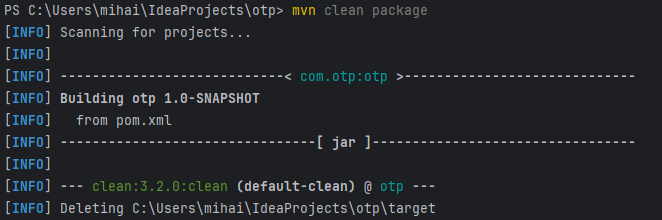
  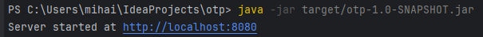
- Регистрация пользователя:
  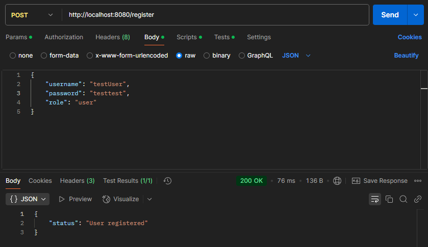
- Авторизация пользователя:
  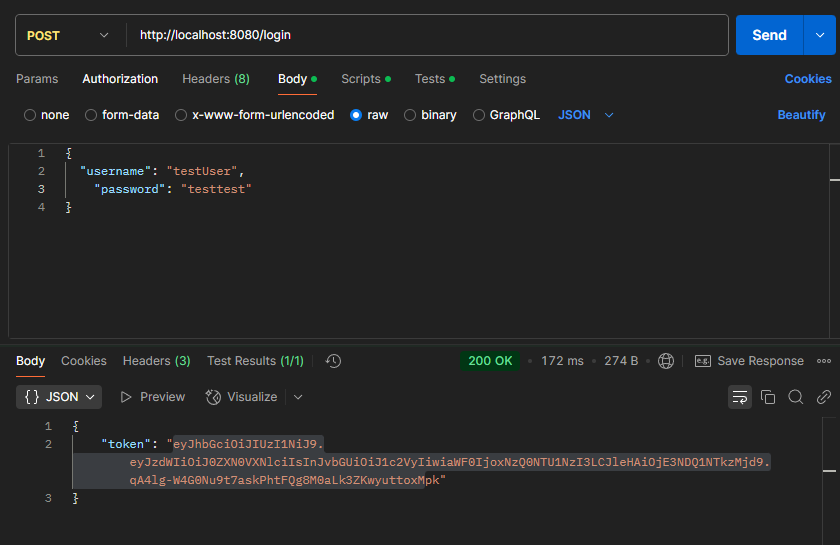
- Генерация OTP и сохранение его в файл:
  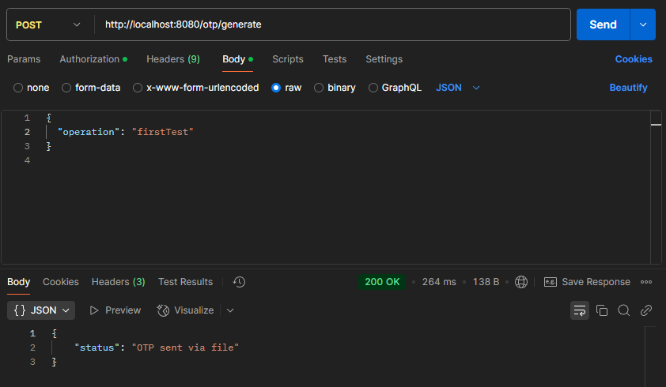
  Также необходимо в `Authorization` указать токен выданный при авторизации:
  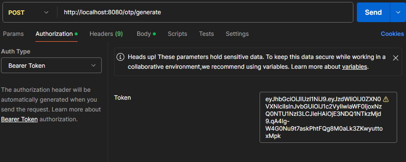
  OTP успешно сохранен в файл:
  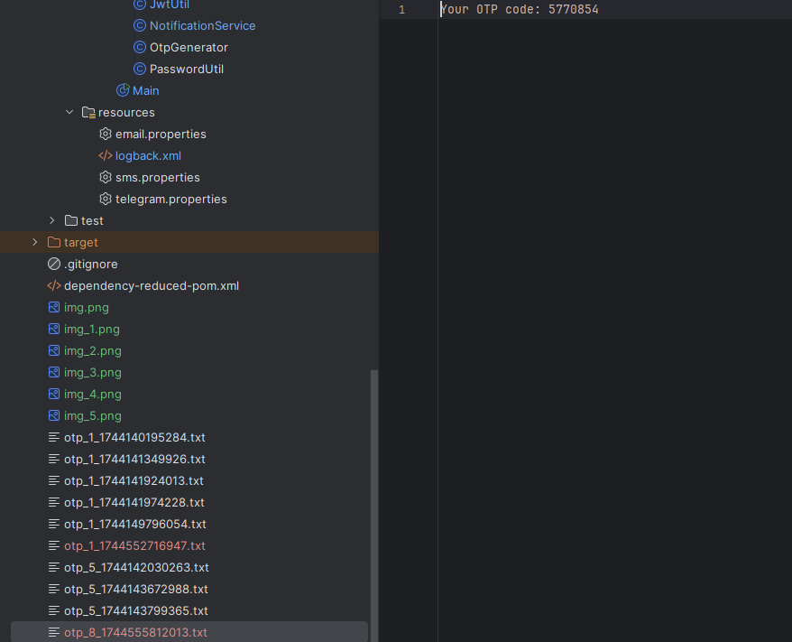
- Генерация OTP и отправка через `telegram`:
  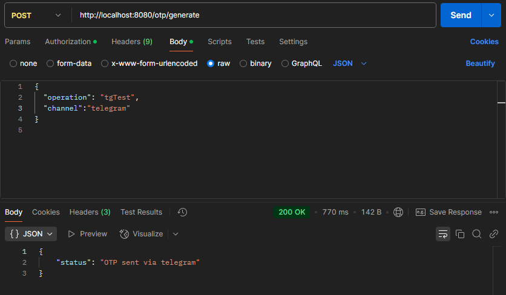
  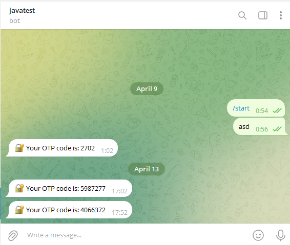
- Генерация OTP и отправка через `email`:
  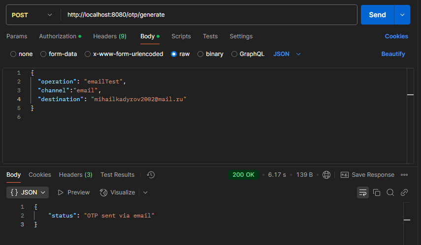
  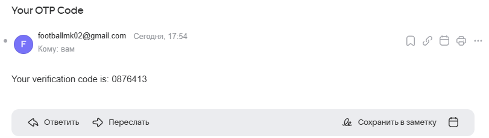
- Генерация OTP и отправка через `sms`:
  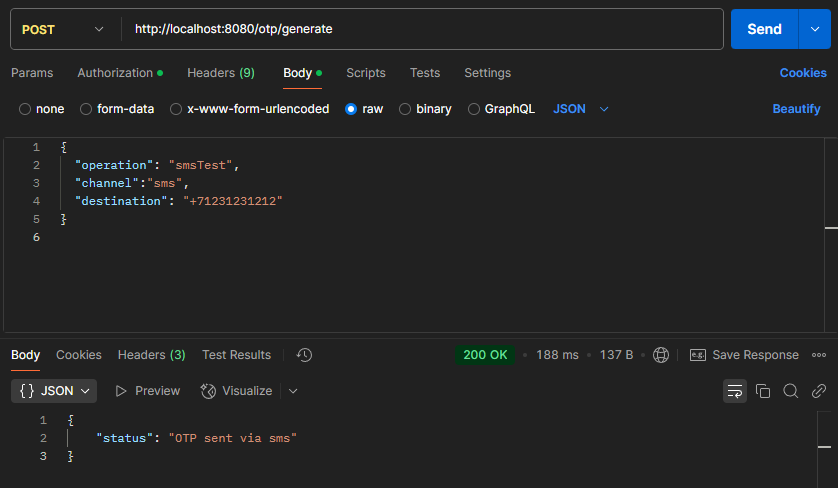
  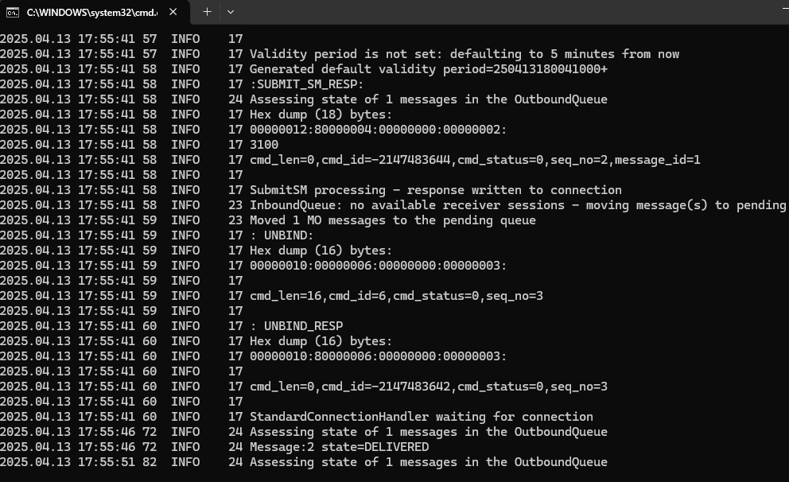
- Валидация OTP:
  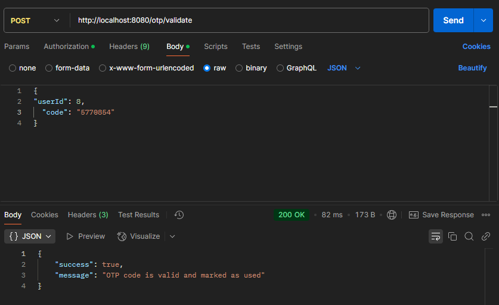
- Изменение настроек OTP (необходимо автризоваться под `admin` и получить его `Bearer token`):
  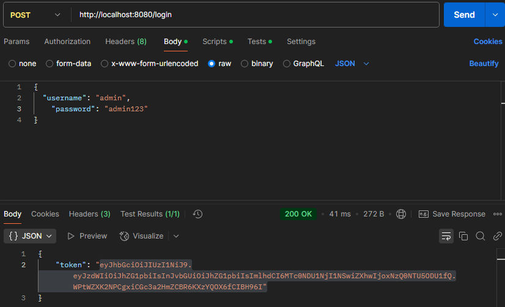
  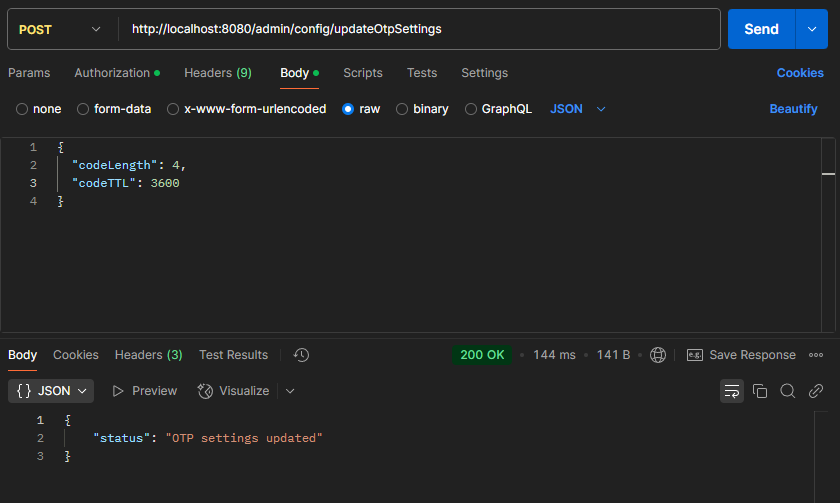
  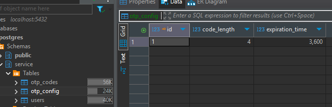
- Получение всех пользователей (необходимо автризоваться под `admin` и получить его `Bearer token`):
  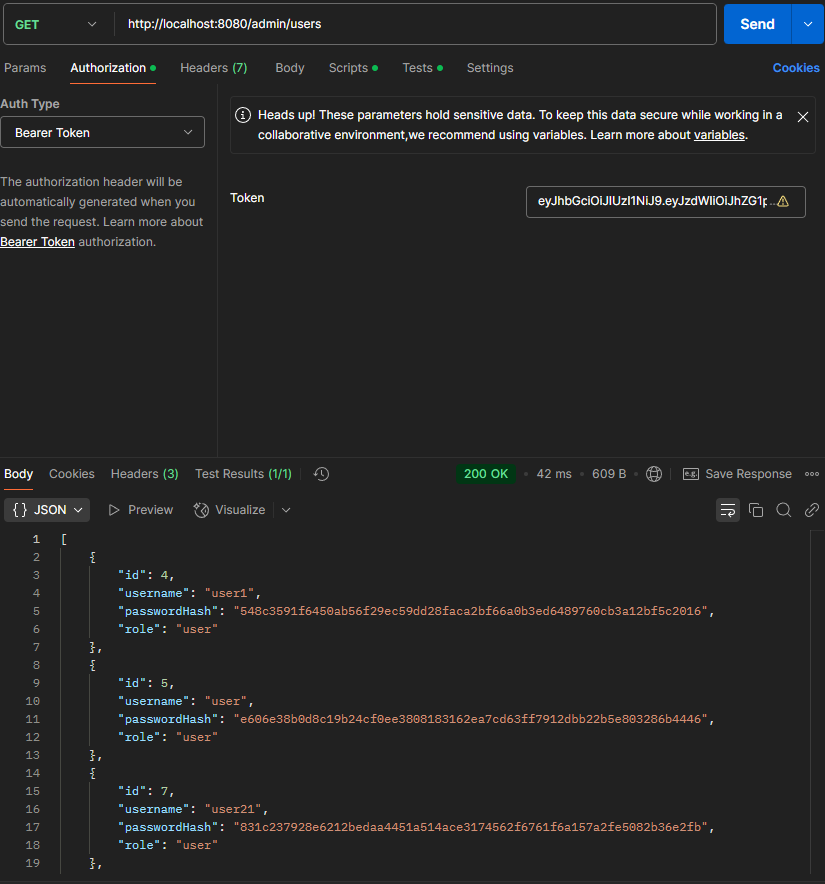
- Удаление пользователя (необходимо автризоваться под `admin` и получить его `Bearer token`):
  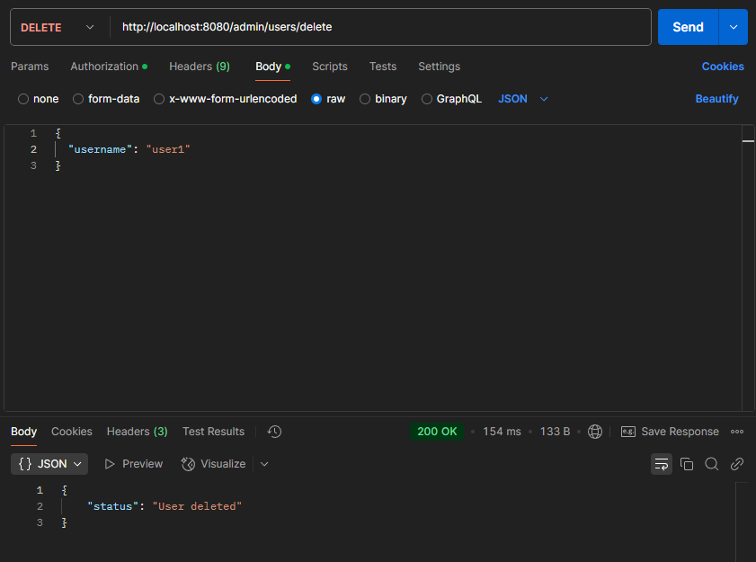
  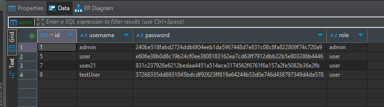

## Дополнительно

- Реализовано изменение статуса OTP кодов в соответствии с заданием (ниже приведен скриншот подтверджающий это):
  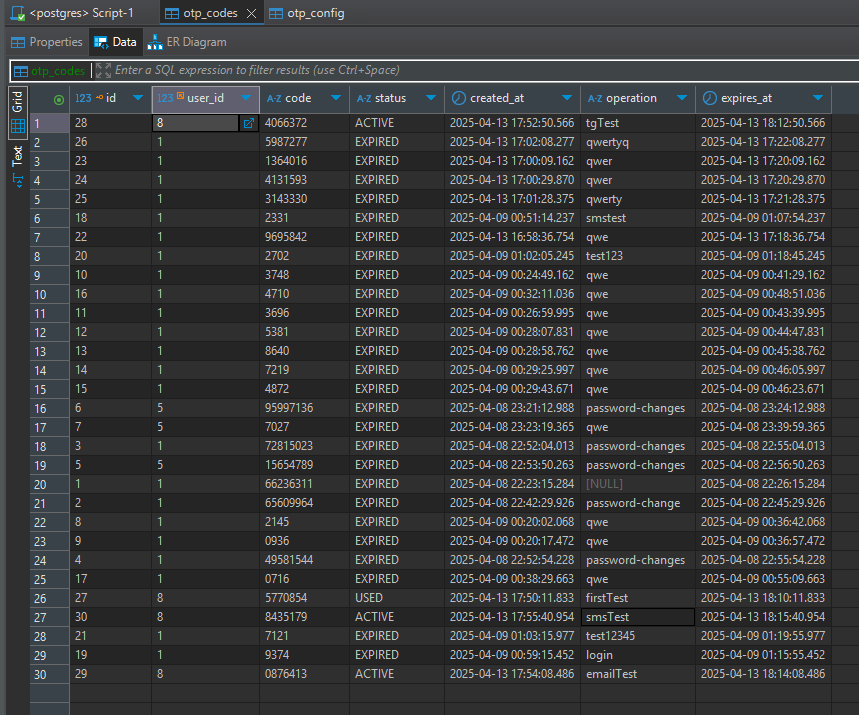
- Реализовано логирование в полном соответствии с условием задачи (логи отображаются в консоли во время работы сервиса,
  а также сохраняются в файл `logs/otp-service.log`):

  Настройки логирования:
    ```XML
        <configuration>
            <!-- Консоль -->
            <appender name="STDOUT" class="ch.qos.logback.core.ConsoleAppender">
                <encoder>
                    <pattern>%d{HH:mm:ss} [%thread] %-5level %logger{36} - %msg%n</pattern>
                </encoder>
            </appender>

            <!-- Файл логов -->
            <appender name="FILE" class="ch.qos.logback.core.rolling.RollingFileAppender">
             <file>logs/otp-service.log</file>
                <rollingPolicy class="ch.qos.logback.core.rolling.TimeBasedRollingPolicy">
                    <fileNamePattern>logs/otp-service.%d{yyyy-MM-dd}.log</fileNamePattern>
                    <maxHistory>7</maxHistory>
                </rollingPolicy>
                <encoder>
                    <pattern>%d{yyyy-MM-dd HH:mm:ss} [%thread] %-5level %logger{36} - %msg%n</pattern>
                </encoder>
            </appender>

            <root level="INFO">
                <appender-ref ref="STDOUT" />
                <appender-ref ref="FILE" />
            </root>
        </configuration>
    ```
